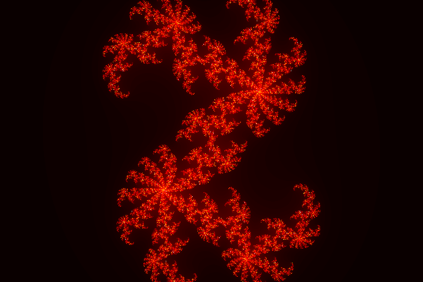
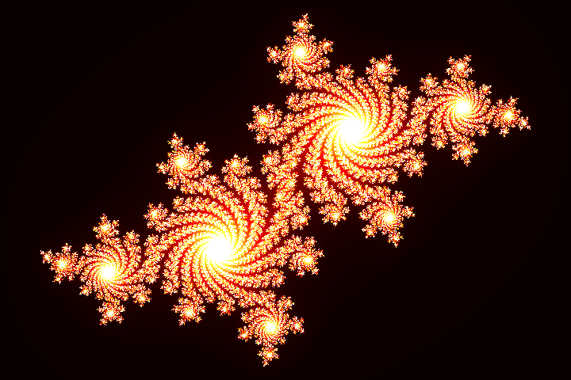
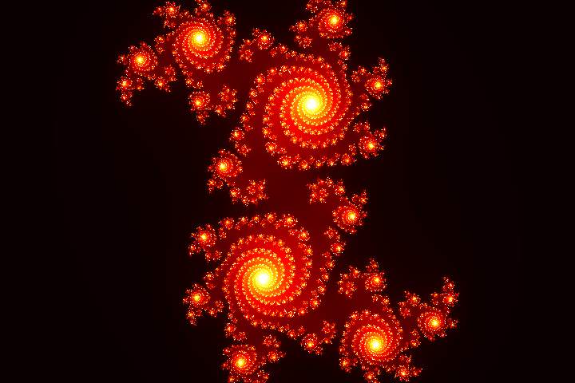
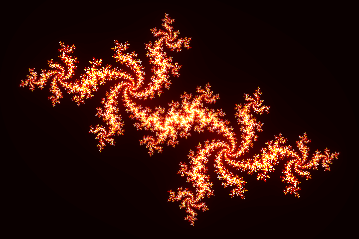

# Hobby
### Python related coding exercises with real-life applications.

## Julia Fractals

**What are Fractals**

A fractal is a never-ending pattern. Fractals are infinitely complex patterns that are self-similar across different scales.They are created by repeating a simple process over and over in an ongoing feedback loop.

**Julia Set Fractals**

The Julia set is named after the French mathematician Gaston Julia who investigated their properties circa 1915 and culminated in his famous paper in 1918. While the Julia set is now associated with a simpler polynomial, Julia was interested in the iterative properties of a more general expression, namely  .The Julia set is now associated with those points  on the complex plane for which the series  does not tend to infinity.  is a complex constant, one gets a different Julia set for each .The initial value  for the series is each point in the image plane. In the broader sense the exact form of the iterated function may be anything, the general form being , interesting sets arise with non-linear functions . The image is created by mapping each pixel to a rectangular region of the complex plane. Each pixel then represents the starting point for the series, . The series is computed for each pixel and if it diverges to infinity it is drawn in white, if it doesn't then it is drawn black.Another property of Julia sets relates to the various domains of . If  is real then the Julia set is mirrored about the real axis. Other values of  with a non-zero imaginary component have 180 degree rotational symmetry.

Some of the patterns obtained for different values of  are shown below:

| | |
|:-------------------------:|:-------------------------:|
|    |      |
|  |     |

## **Percolation Thresholds in Square and Cubic Lattices**

The percolation threshold is a mathematical concept in percolation theory that describes the formation of long-range connectivity in random systems. Below the threshold a giant connected component does not exist; while above it, there exists a giant component of the order of system size. In engineering and coffee making, percolation represents the flow of fluids through porous media, but in the mathematics and physics worlds it generally refers to simplified lattice models of random systems or networks (graphs), and the nature of the connectivity in them. The percolation threshold is the critical value of the occupation probability p, or more generally a critical surface for a group of parameters p1, p2, ..., such that infinite connectivity (percolation) first occurs.

Here we consider only Square and Simple Cubic percolation models.

**Simplifying Assumption**

While in the general case, percolation path from the first row to the last can be such that vacant sites on the path can lie on any adjacent edge, we will make the assumption that percolation is forward only.

Site percolation threshold plots for simple square and cubic lattice models against site vacancy probability is given below:

| | |
|:-------------------------:|:-------------------------:|
|   Site percolation threshold for Simple Square Lattice |      Site percolation threshold for Simple Cubic Lattice|
